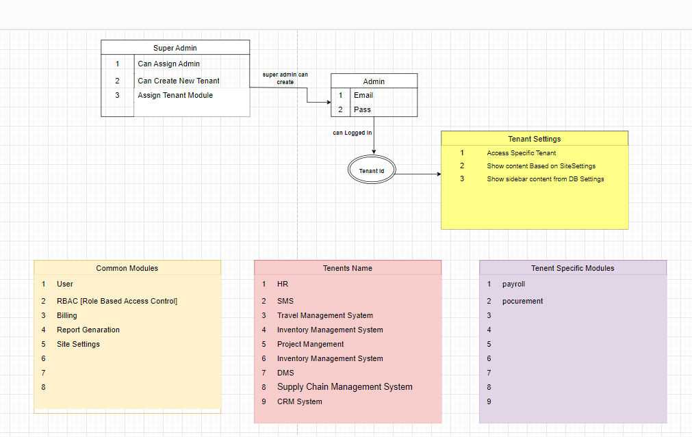

# MS_SaaS_Project

# Healthcare Platform

# Management System SaaS
A comprehensive management system SaaS application designed to streamline business operations. This project offers features such as user management, task tracking, reporting, and analytics, all accessible through a user-friendly interface. Built with modern web technologies for enhanced performance and scalability, this system is ideal for small to medium-sized enterprises seeking to improve efficiency and productivity.

# Live Link 
  !!under construction!!

# SnapShot 

## Features

### User Authentication and Authorization
- Secure user registration and login functionality.
- Role-based access control for different user types (e.g., customers, admins).

### Notifications and Alerts
- Customizable notifications for promotions, discounts, and new arrivals.
- Alerts for medication refills and reminders for health check-ups.

### Responsive Design
- Mobile-friendly interface for seamless access on various devices.
- Responsive layout for optimal viewing and navigation.

## Technologies Used

### Frontend:
  - TypeScript
  - Material UI
  - Tailwind CSS
  - State Management: Redux
  - Testing: Jest
### Backend:
  - TypeScript
  - NestJS
  - Testing: Jest
### Database:
  - NoSQL: MongoDB
### Deployment:
 - Vercel
 - Containerization: Docker
### Authentication:
 - JWT

## Contact Info
  ### Email: hasibul.dcc@gmail.com
  ### GitHub: https://github.com/hasibul1670

Server Live : [Server](https://ms-server-007.vercel.app/api/v1)
